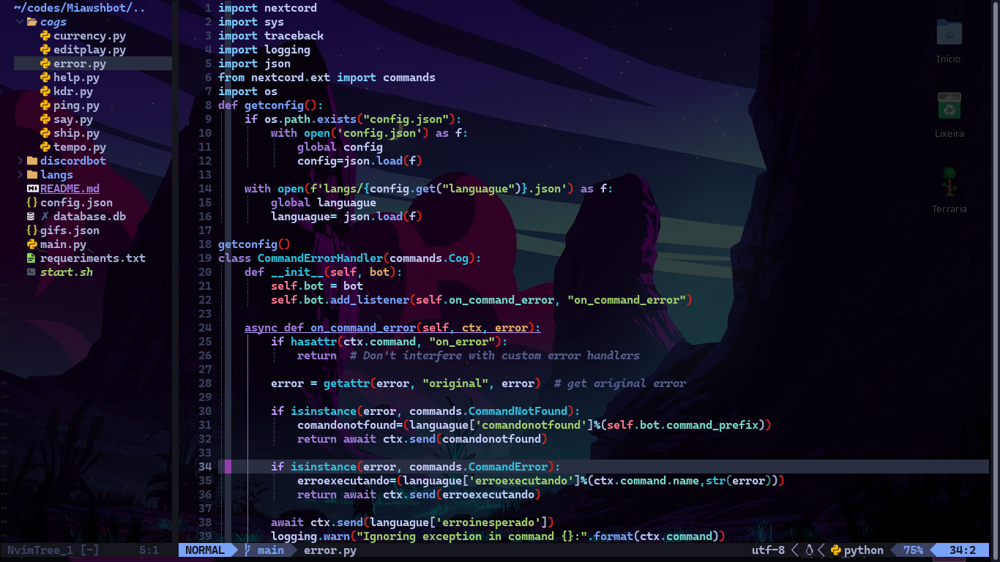

# neovim-config
my personal backup from neovim with transparent background

# Usage:
```bash
git clone --depth 1 https://github.com/Miawshmallow/neovim-config.git ~/.config/nvim && nvim
```

> ❗ **Attention**:<br>
>need to enable transparency in terminal settings to work properly

# Keyboard shortcuts :
- ctrl+s to save
- ctrl+z to undo
- ctrl+y to redo
- ctrl+t open terminal inside nvim
- ctrl+\ to switch to next tab

>! **Info**:<br>
> Use the TransparentToggle command to enable or disable transparency without having to modify the configuration in lua.


